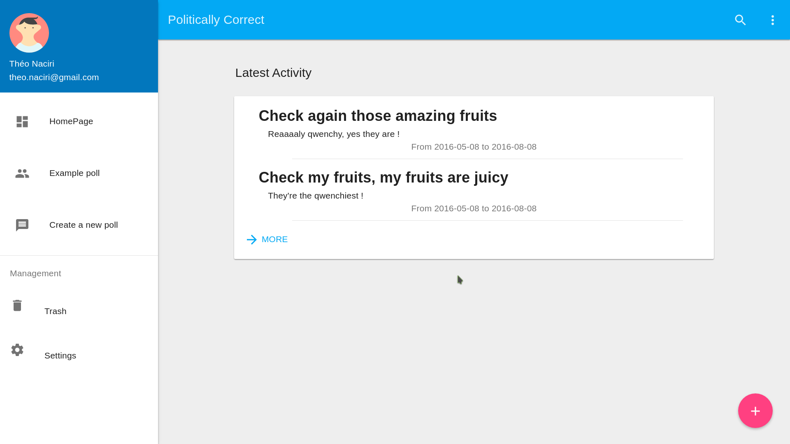
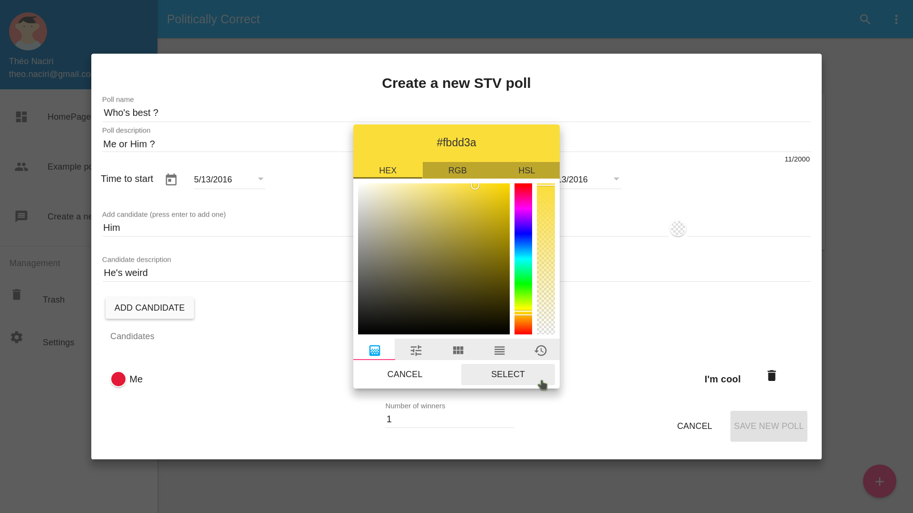
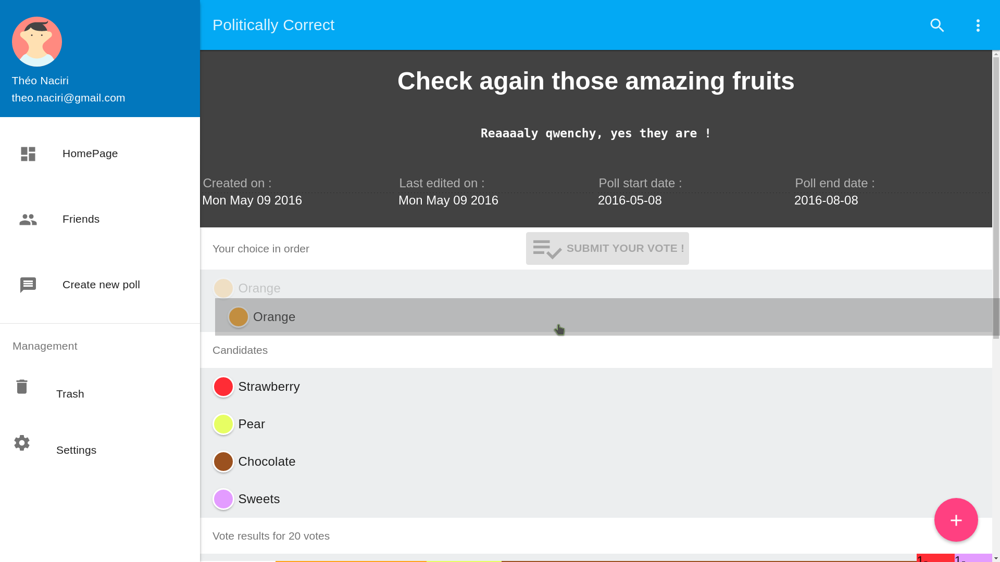

# PoliticallyCorrect
User-generated STV polls for better population representation
https://en.wikipedia.org/wiki/Single_transferable_vote

It's still in early development, come back end of May.

# Features
Drag & drop
Nice material design

# Techno used
Server : [Sails.js] (sailsjs.org), [MongoDB] (https://docs.mongodb.com/), [python-vote-core] (https://github.com/bradbeattie/python-vote-core] for processing the data, [md-color-picker] (https://github.com/brianpkelley/md-color-picker) for color pick. Starter app with [Activity Overlord] (https://github.com/irlnathan/activityoverlord20)
Client : [Angular.js] (https://github.com/angular) with [Angular Material] (https://github.com/angular/material), drag & drop with [Dragular] (https://github.com/luckylooke/dragular), graphs with [d3] (https://github.com/mbostock/d3). Starter app with [Angular Material Design Starter App] (http://codepen.io/kyleledbetter/pen/gpBOdK)

# Pics

   Home Page
   
    
   Create new poll
   
    
    Vote for a poll
    

# Known issues

Date picker - can possibly choose max date prior to min date

# Working on

Results visualization per round using d3.